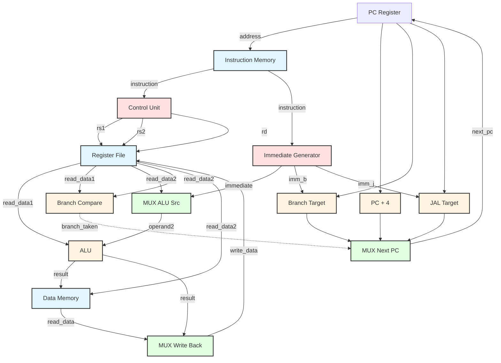
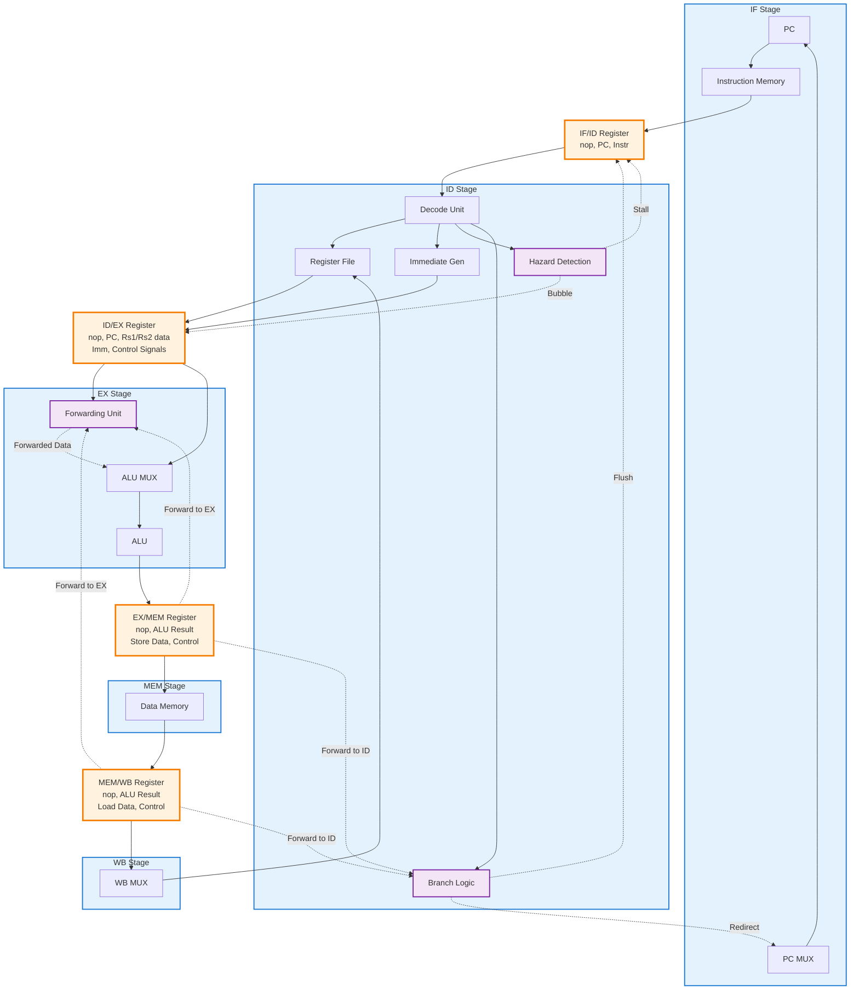
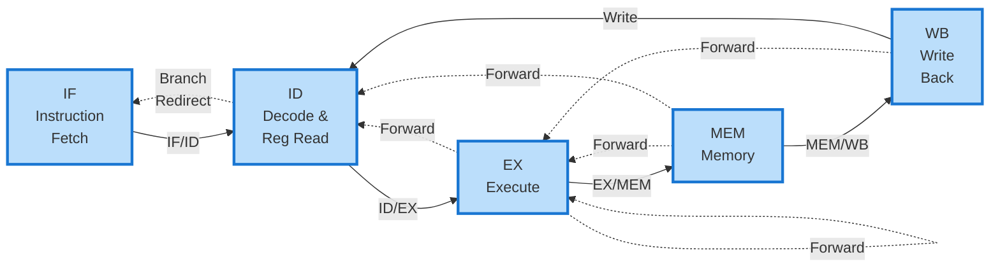

# Mermaid Diagrams for RISC-V Simulator Report

## Instructions:
1. Copy the Mermaid code below
2. Go to https://mermaid.live/ or use Mermaid CLI
3. Paste the code and render
4. Export as PNG or PDF
5. Save as the filename specified below
6. Place in the same directory as submission.latex

---

## TASK 1 DIAGRAM: Single-Stage Processor Schematic (20 points)
**Save as: `figure1.png`**
**Task Requirement:** Draw the schematic for a single stage processor and fill in your code to run the simulator.



---

## TASK 2 DIAGRAM: Five-Stage Pipelined Processor Schematic (20 points)
**Save as: `figure2.png`**
**Task Requirement:** Draw the schematic for a five stage pipelined processor with RAW and control hazard handling (stalling + forwarding).



---

## Alternative: Simpler Five-Stage Diagram
**If the above is too complex, use this simplified version:**



---

## How to Render:

### Option 1: Online (Easiest)
1. Go to https://mermaid.live/
2. Copy one of the code blocks above
3. Paste into the editor
4. Adjust colors/layout if needed
5. Click "Actions" → "PNG" or "SVG" to download
6. Save with the specified filename

### Option 2: VS Code
1. Install "Markdown Preview Mermaid Support" extension
2. Create a .md file with the mermaid code
3. Preview and take screenshot
4. Or use Mermaid CLI to export

### Option 3: Command Line (Mermaid CLI)
```bash
npm install -g @mermaid-js/mermaid-cli
mmdc -i mermaid_diagrams.md -o single_stage_schematic.png
```

### Recommended Settings:
- **Format:** PNG or PDF
- **Width:** 1200-1600 pixels for PNG
- **Background:** White
- **Scale:** 2x for high resolution

---

## Notes:
- The diagrams use different colors to distinguish component types
- Solid arrows = data flow
- Dashed arrows = control signals / forwarding
- Pipeline registers are shown as separate blocks in the pipelined diagram

